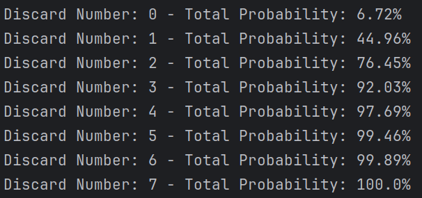

##Hand-Size vs discard number

The comparison is for the base deck looking for Flushes.
The idea is to estimate the relative power of additional cards in hands versus additional discards. 
Base situation is the following

```python
deck = BaseDeck
game_setting = GameSetting(1, 3, 8)
engine = FlushNaiveEngine()
```

With this configuration (8 cards in hands and 3 discard), here are the results:


> Flush Probability: **92%**

## Changing the discard number
Reducing the number of discard brings down to **76%** making it cost: **16%**

Here a detail of the successive value of additional discards:


## Changing the hand size

In the other hand reducing the number of card in hand brings the probability down to **78%** making it worth **14%**
Here is a table of the successive probabilities depending on the number of cards in hand (For 3 discard each time)

| card in hand | Probability |
|--------------|-------------|
| 5            | 21%         |
| 6            | 53%         |
| 7            | 78%         |
| 8            | 92%         |
| 9            | 97%         |
| 10           | 98%         |
| 11           | 99%         |

## Conclusion

Around the base stats, losing a discard is slightly more detrimental than losing 1 hand size. However it's only a 2% difference.