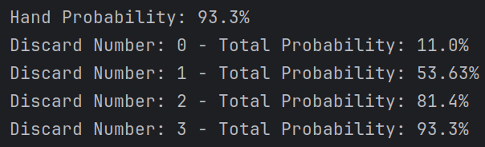

# Base vs Erratic Deck

We are still looking at flushes, here we are looking at the impact of a random distribution
versus the standard one.
Instinctively, having non-regular distribution will help since it gives us a suit more densely packed.

## First engine

We kept the basic configuration (8 cards in hands and 3 discard), here are the results with the current engine
FlushNaive on the erratic deck

> Flush Probability: **93.3%**

A slight increase in probability, but nothing significant at 3 discard. 
The jump is more noticeable with a lower discard number with a 4.5% on raw hands and 9% on a single discard

## Second Engine

There is however room for improvement, I'm not calling this engine the naive one for nothing. This engine is currently
looking at the more represented suit in hand and then discarding everything else. It seems to be quite efficient
(especially for the standard distribution) but in the context of erratic, this can lead to suboptimal decisions.
The first improvement will be to look at the possibility of flush for each suit. If there is only 4 spades remaining in
the hand and the draw pile, a flush is impossible and thus we should always discard those cards.