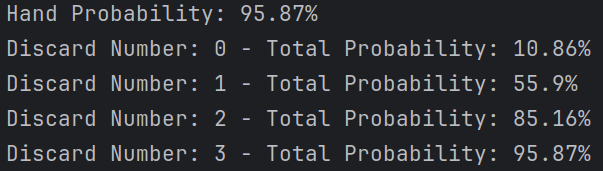

# Base vs Erratic Deck

We are still looking at flushes, here we are looking at the impact of a random distribution
versus the standard one.
Instinctively, having non-regular distribution will help since it gives us a suit more densely packed.

## First engine

We kept the basic configuration (8 cards in hands and 3 discard), here are the results with the current engine
FlushNaive on the erratic deck

> Flush Probability: **93.3%**


A slight increase in probability, but nothing significant at 3 discards. 
The jump is more noticeable with a lower discard number with 4.5% on raw hands and 9% on a single discard

## Second Engine

There is, however, room for improvement.
I'm not calling this engine the naive one for nothing.
This engine is currently looking at the more represented suit in hand and then discarding everything else.
It seems quite efficient (especially for the standard distribution),
but in the context of erratic, this can lead to suboptimal decisions.
The first improvement will be to look at the possibility of flush for each suit.
If there are only four spades remaining in the hand and the draw pile, a flush is impossible,
and thus we should always discard those cards.

Hopefully this improvement will be more significant once we start asking for multiple flushes in the same round.
To challenge this hypothesis, we will look at the impact on probability on a smaller Erratic Deck.
One with only 19 cards (making at least one suit illegal) might show stronger results with the smarter engine.
Another side effect of having only 19 cards is that by digging enough, you will see all the cards of the deck.
Allowing a smart player to draw flushes for sure.

For that, we are adding deck settings as a way to customize the deck.
Here is the experience:

```python
deck = ErraticDeck
game_setting = GameSetting(1, 3, 8)
engine = FlushV0Engine()
deck_setting = DeckSetting(deck_size=19)

computer = ProbabilityComputer(deck, game_setting, engine, 100000, deck_setting)
computer.run()
```

And the results are a bit more probing:

> V0 Engine: **88%**
> V1 Engine: **100%**

As expected, since the V1 engine knows which suit is impossible, it will dig for a "legal" suit and always end up with
a flush in hand.

Details are here:
- FlushV0:


- FlushV1:


Adding more and more cards is progressively reducing this advantage of the second improvement since,
as soon as all flushes are legal, both engines work identically.

For example, at half a deck (26 cards), the V0 engine is already at 93% and the V1 engine at 95%.

## Third Engine

We are adding a new improvement which is looking at the density of each suit in the draw pile and adapting the strategy
accordingly.
This is a bit more complex to implement, but the idea is to combine the cards in hands (certain hits) with the
average card in the draw pile.
So the score for each suite will be: 

```python
number_of_suite_cards_in_hand + number_of_drawn_cards * number_of_suite_cards_in_draw_pile/number_of_cards_in_draw_pile
```

> V2 Engine: **96%**

This is quite an improvement compared to the previous version, even for a complete deck.

Details are here:



## Conclusion

We improved the flush engine quite a bit, which is nice.
We also demonstrated that a non-regular distribution is beneficial for a single flush probability.

The next step will be looking at the exact impact of a single suit-changing tarot card on the flush probability. 
We will later expand on the probability of multiple flushes, which might be opposite of the single flush case.
