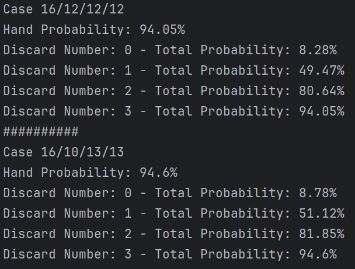
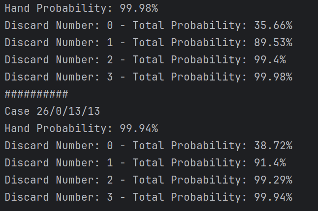

# Impact of STC (Suit-change Tarot Card)

## Introduction

A Suit-change Tarot Card is a card used like this:
- You draw a random suit
- You draw 8 cards from the deck
- You can choose up to 3 cards among the 8, and change their suit to the picked suit

We know that an irregular suit distribution is beneficial for flush probabilities thanks to the previous analysis.
So the question now is what's the best use of an STC?
And also, how impactful is a single STC on the deck?

## Best Usage

In this chapter, I'll be referring to suit distribution like this: 13/13/13/13.
An array of four numbers, where each number is equal to the number of cards per suit in the deck.

Logically, the end goal of a flush deck is to be: 52/0/0/0.
Hence, guaranteeing a flush in each hand, and these flushes the exact suit needed.

However, is the best path toward to decrease each suit progressively and go:
> 13/13/13/13 -> 16/12/12/12 -> 19/11/11/11

Or is the best path to try and remove entirely on suit at a time like this: 
> 13/13/13/13 -> 16/10/13/13 -> ... -> 26/0/13/13 -> 39/0/0/13

To measure this, I'll create two new decks (Probably getting removed afterward to ingest STC less artificially) and
compute the flush probabilities for one.

### First Deck: 16/12/12/12

Analysis: 
```python
game_setting = GameSetting(1, 3, 8)
engine = FlushV2Engine()
run_number = 1000000

print("Case 16/12/12/12")
deck = BaseDeck_16_12_12_12
computer = ProbabilityComputer(deck, game_setting, engine, run_number)
computer.run()

print("##########")

print("Case 16/10/13/13")
deck = BaseDeck_16_10_13_13
computer = ProbabilityComputer(deck, game_setting, engine, run_number)
computer.run()
```

Result: 



The impact is small, but after one million runs, we can see that the second deck is slightly better than the first one.
This is a good sign, as it seems to mean that the best path is to remove entirely one suit at a time.

To further test this out, I'll create 2 new decks:
- 26/0/13/13
- 26/9/9/8

And we'll see if the trend is confirmed.

Results:



The trend is confirmed for the discard number 0 and 1. However, it's less noticeable for the discard number 2 and 3
since we are really close to 100% at that point anyway.