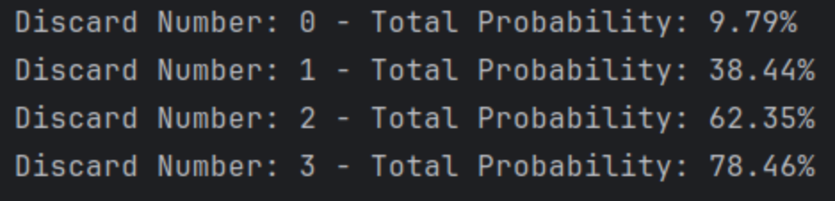
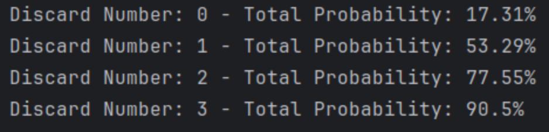
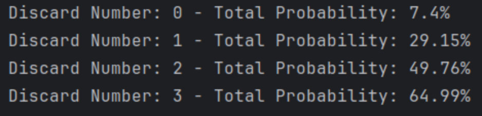
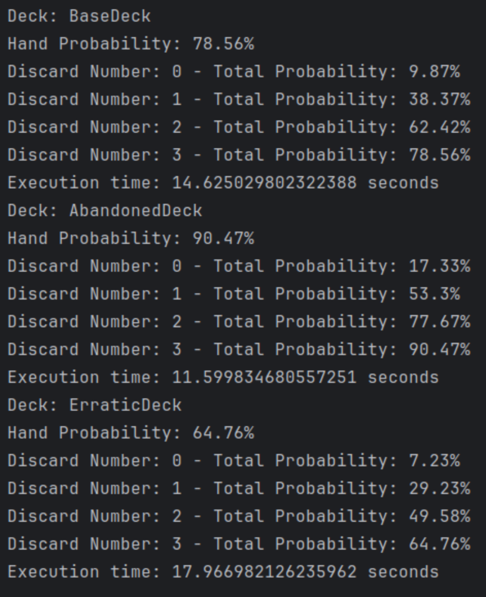
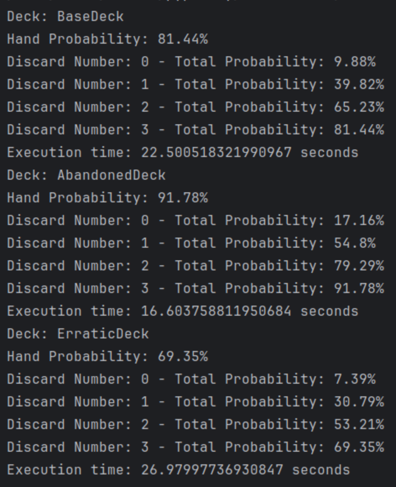

# Straight Analysis

## Intro 

- We are going to compare the probability of Straight and Flushes. 
- We are going to refine the StraightEngine and see how we can bolster it's efficiency

## First Engine

The first engine is fairly naive. It looks at each possible series of 5 value that make a straight.
Those series are: Ace/2/3/4/5 -> ... -> 10/Jack/Queen/King/Ace.
For each of those 'locations' it count the number of card already present. And then pick the most full one. 
It doesn't care for now for any cards in the deck or the order of the cards. 4 cards in a row vs 2 and 2 + a hole seems
equally good to him.

First results:

> Probability: 78.5%

## Second Engine

In order to test the new improvement we are going to switch to the abandoned deck.
This is the deck without any face cards.
It's also the deck with which we tend to go with straight. 

The main difference for this deck is that now, there are straights that become impossible
(All those including a face card. So 7/8/9/10/Jack for example).
We are going to teach the engine to avoid those locations in its computation.

Before improvement, the results for the abandoned deck are: 

> Probability (Abandoned) : 90,5%

This seems quite logical but indeed removing ranks is going to make the straight more probable by reducing the number of
possible straight and thus the number of non-matching cards.

We are also trying on the erratic deck, instinctively, when this deck's variance was impacting positively the flushes
it will probably be negative for the straight.

> Probability (Erratic): 65%

Our instinct was right, the straights seems to enjoy more regularity in the base repartition. 

Let's see how forbidding the impossible location security improve those performances.

1. BaseDeck: 78.5% -> 78.5%
2. AbandonedDeck: 90.5% -> 90.5%
3. ErraticDeck: 64.8% -> 64.8%

Details are here: 

This is quite funny, but it seems that the improvement didn't change anything noticeably.

## Third Engine

Another potential improvement is to make the engine try to avoid the straight with holes in it. 
As an example, between 2/3/5/6 and 2/3/4/5, the second one is more likely to be completed since they are 8 outs 
(Aces and 6s) vs 4 outs (4s).

To manage that, we are going to reduce .5 points to the score of the straight location if there is a hole in it.

The results are:

1. BaseDeck: 78.5% -> 81.44%
2. AbandonedDeck: 90.5% -> 91.8%
3. ErraticDeck: 64.8% -> 69.4%

This is a good improvement. Winning a few percentage for each deck by trying to focus on non holes. 

## Fourth Engine

A last improvement would be counting the number of outs for each location. In order to focus on the most plausible
location to complete the straight when the other measures are equal. In order to do that, we'll once again update the
scoring system.
We'll have to make sure the score update for outs is at most equal to 0.5.
For that we'll normalize it for the base deck format.

Finally, in the specific case of 4 consecutive, the second out is outside the location of 5 cards.
So we'll need to take the 6th position among the computation. 
